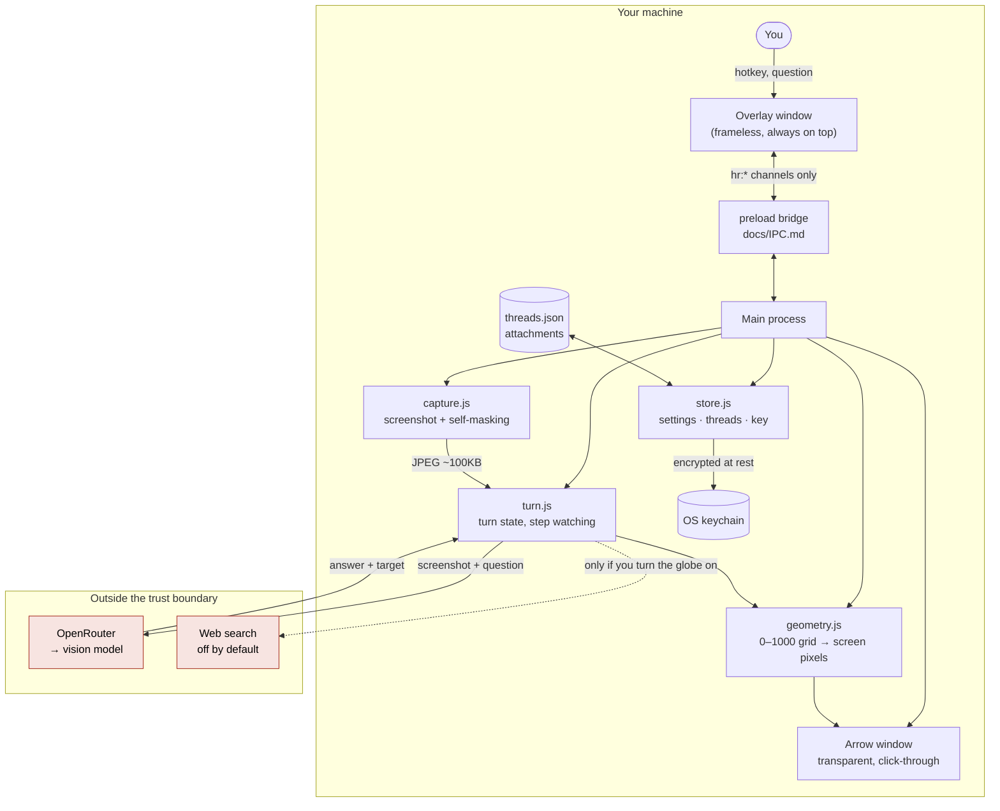

<div align="center">


# Handrail

**Product · open source** — a desktop overlay that watches your screen, answers questions about it, and draws an arrow at the control you need.

<br>


<sub>A real question, a real screen, a real arrow. Not a mockup — this is the shipped build.</sub>

</div>

---

## What it is

Most software help assumes you already know what things are called. You search,
find a tutorial, watch someone do it on *their* screen, then try to map it onto
yours. The gap between "the button in the top right" and the button actually in
front of you is where people give up.

Handrail sits on top of the application you are already using. Ask it something
and it takes a screenshot, works out what is on your screen, and answers about
*your* situation — then draws an arrow on the real control you need to touch.
It is built for someone who can follow an instruction precisely but cannot
diagnose why step 4 failed.

## How it works

1. You press a hotkey and type a question into a bar that floats over whatever you are doing.
2. Handrail captures the screen it is sitting on, blanking out its own window so it never asks about itself.
3. The screenshot and your question go to a vision model, along with the last few turns of the conversation and any files you attached.
4. The model replies — either a short answer, or a checklist when the job genuinely takes several steps — and names the one control you need to touch.
5. A second pass sends the same screenshot back and asks only *where* that control is, as coordinates.
6. Handrail draws an arrow at that spot on your real screen, in a transparent window that ignores your clicks.
7. For a checklist, it keeps watching: every few seconds it re-checks the screen and ticks off each step as you finish it, so you never mark anything done yourself.

## Architecture



The screenshot and your API key never cross the bridge into the interface
layer. The renderer receives a masked hint of the key and nothing else.

## Stack

| Layer | What | Why |
|---|---|---|
| Shell | Electron 43.3.0 | One codebase for macOS and Windows, and the only way to draw a click-through window over other apps |
| Runtime deps | `dotenv` only | The app has one production dependency; everything else is Electron and Node built-ins |
| Model access | OpenRouter | One key reaches every provider, so the model is a setting rather than a rewrite |
| Default model | `google/gemini-3.5-flash` | The cheapest model that reliably reads a screen. The lite tier invented menu paths for UI that was not in the screenshot |
| Pointing | Second vision pass, 0–1000 normalised grid | Resolution-independent by definition, so DPI and multi-monitor never enter the maths |
| Capture | Electron `desktopCapturer` | 1600px JPEG for answering, native-resolution PNG for locating a control |
| Key storage | Electron `safeStorage` → OS keychain | Encrypted at rest by the operating system, not by us |
| Threads | JSON on disk, in the app's data directory | No database, no account, no server |
| Tests | Node's built-in runner · Playwright `_electron` | No framework, and the unit tests need neither a display nor a key so they can gate CI |
| Packaging | electron-builder 26 | `.dmg` and `.exe` built in CI on both platforms for every tagged release |

## Key points

- **You need your own API key** from OpenRouter, OpenAI or Anthropic. There is no account, no sign-up and no free tier — you pay your provider directly.
- **The arrow only works on some models.** Confirmed on `google/gemini-3.5-flash`. Claude Sonnet answered five consecutive questions on 2026-08-10 without ever naming a target, so no arrow was drawn at all. If pointing stops, check the model before assuming a bug.
- **Both builds are unsigned.** macOS refuses the first launch until you use **Open Anyway**; Windows SmartScreen warns. Signing costs $99/year per platform and is not in place.
- **On macOS, every update costs you your key and your screen permission.** macOS ties both to the app's signature, and an unsigned build's signature changes on every build. This ends when the app is signed, not before.
- **Web search is off by default.** Everything else stays on your machine; turning the globe on sends your question to a search provider.
- **A reply takes about 4–10 seconds** (measured 2026-08-12, single 1x display). Roughly 200ms of that is the screenshot; the rest is the model.

## Getting started

```bash
git clone https://github.com/M19K/handrail.git
cd handrail
npm install
npm start
```

Onboarding asks for an API key and works out which provider it belongs to from
the key's own format. Or download a build from
[Releases](https://github.com/M19K/handrail/releases) — `.dmg` for macOS
(`-arm64` for Apple Silicon), `.exe` for Windows.

**Press `Cmd+Shift+H`** (macOS) or **`Ctrl+Shift+H`** (Windows) to summon it.
`Cmd+Shift+Esc` / `Ctrl+Alt+H` hides it instantly, for when it is on screen
during a call.

## Status and licence

**v0.1.9, released 2026-08-12 for macOS and Windows.** Working and in daily use
by its author; not yet used by anyone else.

What is measured, as of 2026-08-12: 159 unit tests, 63 smoke checks against the
real main process, and 29 Playwright tests against the real Electron app, all
passing. The packaged macOS bundle is launched and verified in CI before any
release is published.

What is **not** proven: the arrow has never been verified on a macOS Retina
display — the test machine is a single 1x monitor — and no model other than
`google/gemini-3.5-flash` is confirmed to drive it. The Windows build of 0.1.9
has been built and verified by CI but never run by a person. There is no
performance benchmark and no noise floor behind the latency figures above; they
are single observations, not a distribution.

This README follows the Mikoshi Product README Standard, which lives in that
project and is deliberately not restated here — a standard copied into six repos
drifts the first time one copy is edited.

Licensed under [Apache 2.0](LICENSE). Original work by Maaz Kazi; commit
`7909792` is the pristine upstream import, so `git diff 7909792..HEAD` is
exactly and only the original work. Credit and third-party notices are in
[NOTICE](NOTICE).

---

## Development

```bash
npm start              # run the app
npm test               # unit tests, no Electron needed
npm run dev:renderer   # drive the UI through every state, screenshot each
npx electron scripts/smoke.js   # boot the real windows and check them
npm run verify:mac     # launch the PACKAGED .app — the only check that does
npm run doctor         # the machine around the app, not the app
```

The suites are layered on purpose, because each is blind to the one below it.
The unit tests never launch Electron, `smoke.js` never opens the packaged
bundle, `verify:mac` never asks whether a reply was any good, and none of them
can see the machine. `src/main/llm.scenarios.test.js` is the newest layer and
the least obvious: it puts real user questions through the real reply path and
asserts what a person would notice — that a reply is never empty, never raw
JSON, and never ends on a colon promising a list it does not deliver.

`npm run qa` is the Playwright renderer suite. It is **not** the QA standard —
product QA runs through Mikoshi's `mikoshi-qa`, against `QA/Use Cases.md`.

Set `STEALTH_MODE=false` to make the overlay visible to screen recording, which
you will want when screenshotting the UI.

### Layout

```
main.js               entry point
preload.js            the entire main↔renderer bridge  (see docs/IPC.md)
src/main/             store · llm · capture · turn · windows · ipc
renderer/             overlay · arrow · onboarding
design/               tokens, brand assets, and the design work behind them
spike/arrow/          the go/no-go spike for on-screen pointing
docs/IPC.md           the IPC contract
```

Project documents: [PRODUCT.md](PRODUCT.md) for what Handrail is and how it
behaves, [DECISIONS.md](DECISIONS.md) for every decision and why,
[CONTEXT.md](CONTEXT.md) for current state, [PLATFORM.md](PLATFORM.md) for
Windows/macOS parity.
